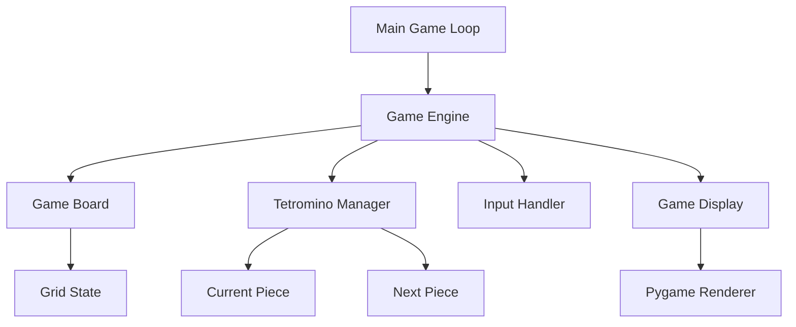

# Design Document: Simple Tetris

## Overview

学習用の簡単なTetrisゲームをPythonとPygameライブラリを使用して実装する。オブジェクト指向設計を採用し、ゲームロジックと表示を分離した構造とする。基本的なTetrisの機能を持ちつつ、コードの理解しやすさを重視する。

## Architecture

### システム構成



### 技術スタック

- **Python 3.8+**: メインプログラミング言語
- **Pygame**: グラフィックス、入力処理、ゲームループ
- **標準ライブラリ**: random（Tetromino生成）、time（タイミング制御）

## Components and Interfaces

### 1. Game Engine (`GameEngine`)

ゲーム全体の制御を行うメインクラス。

```python
class GameEngine:
    def __init__(self):
        self.board: GameBoard
        self.current_piece: Tetromino
        self.next_piece: Tetromino
        self.game_over: bool
        self.fall_time: float
        
    def update(self, dt: float) -> None
    def handle_input(self, keys: dict) -> None
    def spawn_new_piece(self) -> None
    def check_game_over(self) -> bool
```

### 2. Game Board (`GameBoard`)

ゲームフィールドの状態管理。

```python
class GameBoard:
    def __init__(self, width: int = 10, height: int = 20):
        self.width: int
        self.height: int
        self.grid: List[List[int]]
        
    def is_valid_position(self, piece: Tetromino, x: int, y: int) -> bool
    def place_piece(self, piece: Tetromino, x: int, y: int) -> None
    def clear_lines(self) -> int
    def is_line_full(self, row: int) -> bool
```

### 3. Tetromino (`Tetromino`)

テトロミノの形状と操作を管理。

```python
class Tetromino:
    def __init__(self, shape_type: str):
        self.shape_type: str
        self.shape: List[List[int]]
        self.x: int
        self.y: int
        self.rotation: int
        
    def rotate(self) -> None
    def move(self, dx: int, dy: int) -> None
    def get_rotated_shape(self) -> List[List[int]]
```

### 4. Game Display (`GameDisplay`)

画面描画を担当。

```python
class GameDisplay:
    def __init__(self, screen_width: int = 800, screen_height: int = 600):
        self.screen: pygame.Surface
        self.block_size: int = 30
        
    def draw_board(self, board: GameBoard) -> None
    def draw_piece(self, piece: Tetromino) -> None
    def draw_next_piece(self, piece: Tetromino) -> None
    def draw_game_over(self) -> None
```

## Data Models

### Tetromino Shapes

7種類の標準的なテトロミノを定義：

```python
TETROMINO_SHAPES = {
    'I': [
        ['....', 'IIII', '....', '....'],
        ['..I.', '..I.', '..I.', '..I.']
    ],
    'O': [
        ['OO', 'OO']
    ],
    'T': [
        ['.T.', 'TTT', '...'],
        ['.T.', '.TT', '.T.'],
        ['...', 'TTT', '.T.'],
        ['.T.', 'TT.', '.T.']
    ],
    'S': [
        ['.SS', 'SS.', '...'],
        ['.S.', '.SS', '..S']
    ],
    'Z': [
        ['ZZ.', '.ZZ', '...'],
        ['..Z', '.ZZ', '.Z.']
    ],
    'J': [
        ['J..', 'JJJ', '...'],
        ['.JJ', '.J.', '.J.'],
        ['...', 'JJJ', '..J'],
        ['.J.', '.J.', 'JJ.']
    ],
    'L': [
        ['..L', 'LLL', '...'],
        ['.L.', '.L.', '.LL'],
        ['...', 'LLL', 'L..'],
        ['LL.', '.L.', '.L.']
    ]
}
```

### Game State

```python
@dataclass
class GameState:
    board: List[List[int]]
    current_piece: Tetromino
    next_piece: Tetromino
    score: int
    lines_cleared: int
    level: int
    game_over: bool
```

## Correctness Properties

*A property is a characteristic or behavior that should hold true across all valid executions of a system-essentially, a formal statement about what the system should do. Properties serve as the bridge between human-readable specifications and machine-verifiable correctness guarantees.*
### Converting EARS to Properties

プレワーク分析に基づいて、テスト可能な受入基準を実行可能なプロパティに変換します。

**Property 1: Tetromino Movement**
*For any* valid Tetromino and any valid board position, moving the piece left/right/down should update its position by exactly one cell in the specified direction
**Validates: Requirements 2.1, 2.2, 2.3**

**Property 2: Tetromino Rotation**
*For any* Tetromino (except O-piece), rotating clockwise should cycle through all valid rotation states and return to the original state after 4 rotations
**Validates: Requirements 2.4**

**Property 3: Collision Detection**
*For any* Tetromino and any board state, attempting to move or rotate into an invalid position (boundary or occupied cell) should leave the piece unchanged
**Validates: Requirements 2.5**

**Property 4: Automatic Fall**
*For any* game state with a falling piece, after the fall interval elapses, the piece should move down by one row
**Validates: Requirements 3.1**

**Property 5: Piece Placement**
*For any* Tetromino that cannot move down further, the piece should be fixed to the board and a new piece should be spawned
**Validates: Requirements 3.2, 3.3**

**Property 6: Line Clearing**
*For any* board state with one or more complete horizontal lines, all complete lines should be removed and rows above should shift down appropriately
**Validates: Requirements 4.1, 4.2, 4.3**

**Property 7: Display Completeness**
*For any* game state, the display should accurately show the current board, falling piece, fixed blocks, and next piece
**Validates: Requirements 5.1, 5.2, 5.3, 5.4**

**Property 8: Game Over Detection**
*For any* board state where a new piece cannot be placed at the spawn position, the game should enter game over state and disable input
**Validates: Requirements 6.1, 6.3**

**Property 9: Game Over Display**
*For any* game over state, the display should show an appropriate game over message
**Validates: Requirements 6.2**

**Property 10: Tetromino Generation**
*For any* sequence of piece generation, all seven types (I, O, T, S, Z, J, L) should be available and selected randomly
**Validates: Requirements 7.1, 7.2**

**Property 11: Shape Accuracy**
*For any* Tetromino type, the shape and all rotation states should match the standard Tetris specifications
**Validates: Requirements 7.3**

## Error Handling

### Input Validation
- 無効なキー入力は無視する
- ゲームオーバー状態では移動・回転入力を無効化
- 境界外への移動試行は無効化

### State Management
- 不正な状態遷移を防ぐ
- ボード境界チェック
- 衝突検出の確実な実行

### Resource Management
- Pygameの適切な初期化と終了処理
- メモリリークの防止

## Testing Strategy

### Dual Testing Approach

**Unit Tests**:
- 特定の例やエッジケースの検証
- 各クラスの個別機能テスト
- 統合ポイントでの動作確認
- 最小限のテストで核心機能に集中

**Property-Based Tests**:
- 全入力に対する普遍的プロパティの検証
- ランダム化による包括的入力カバレッジ
- 各プロパティテストは最低100回の反復実行
- 各テストは対応するデザインプロパティを参照

**Property-Based Testing Configuration**:
- **Testing Library**: `hypothesis` (Python用プロパティベーステストライブラリ)
- **Test Iterations**: 各プロパティテストで最低100回実行
- **Tag Format**: `# Feature: simple-tetris, Property {number}: {property_text}`
- **Requirements**: 各正確性プロパティは単一のプロパティベーステストで実装

**Testing Balance**:
- Unit tests: 具体的な例、エッジケース、エラー条件に焦点
- Property tests: 多数の入力に対する一般的な正確性の検証
- 両方のアプローチが補完的で包括的なカバレッジを提供

### Test Organization
```
tests/
├── unit/
│   ├── test_tetromino.py
│   ├── test_game_board.py
│   └── test_game_engine.py
└── property/
    ├── test_movement_properties.py
    ├── test_collision_properties.py
    └── test_line_clearing_properties.py
```

### Integration Testing
- ゲームループ全体の動作確認
- 入力から表示までの完全なフロー
- 複数コンポーネント間の相互作用